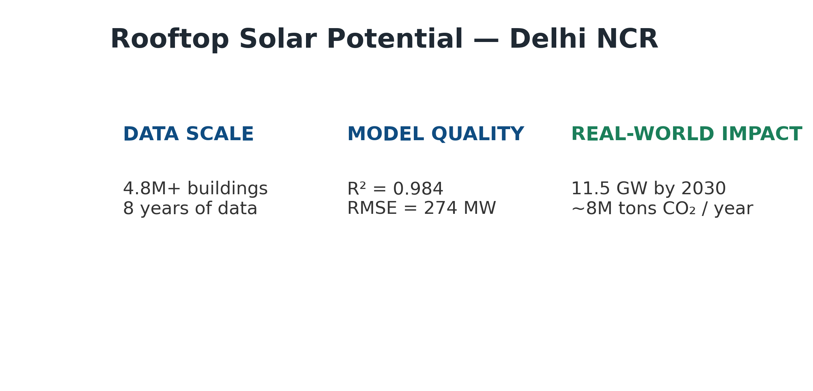

# Rooftop Solar Potential Mapping — Delhi NCR

### Data Science & Machine Learning Project

This project estimates the rooftop solar energy potential of the Delhi NCR region by integrating
satellite-derived solar irradiation data, urban building footprints, and machine learning forecasting.
The objective is to support sustainable energy planning and solar-powered EV adoption.

---

## 📊 Executive Summary

- **Data**: 8 years (2015–2023), 4.8M+ buildings, 5 NCR cities  
- **Model**: Optimized Random Forest  
- **Performance**: R² = 0.984, RMSE = 274 MW  
- **2030 Forecast**: ~11.5 GW rooftop solar capacity  
- **Impact**: ~8 million tons CO₂ avoided annually

---

## 🗂 Data Sources

- NASA POWER — Solar irradiation
- OpenStreetMap — Building footprints
- MNRE Guidelines — Technical and economic parameters

---

## ⚙️ Methodology

1. Data acquisition and cleaning  
2. Feature engineering (climatic, urban, temporal)  
3. Baseline modeling (Linear Regression)  
4. Non-linear modeling (Random Forest)  
5. Scenario-based forecasting (2024–2030)

---

## 🤖 Model Performance

### Actual vs Predicted Solar Capacity

### City-wise Prediction Error

---

## 🔍 Key Insights

- Strong seasonal patterns drive solar generation
- Geographic features dominate model predictions
- Technology improvements impact capacity more than air-quality changes

---

## ⚠️ Limitations

- Partial reliance on synthetic historical data
- Assumptions on policy and adoption rates
- Rooftop orientation and shading not explicitly modeled

---

## 🚀 Future Work

- Integrate real installation and utility data
- Improve pollution sensitivity features
- Incorporate spatial autocorrelation models

---

## 📌 Repository

All notebooks, data processing scripts, and detailed analysis are available in the GitHub repository.
